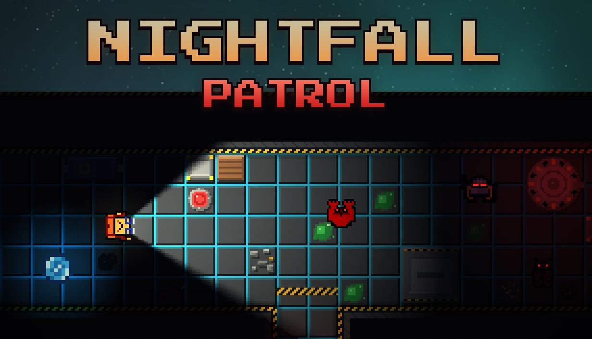
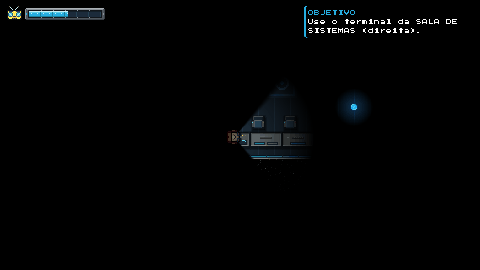
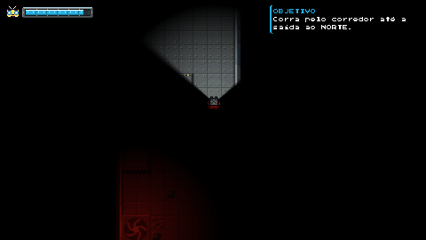
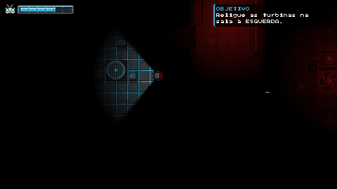
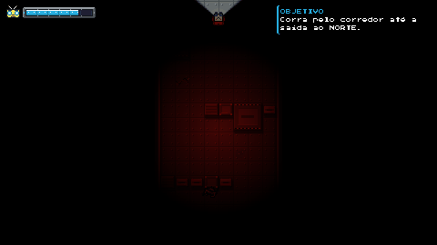

<p align="center">
  
</p>

<h1 align="center">Nightfall Patrol</h1>

<p align="center">
  <b>Os reatores falharam. A nave está no escuro. E você não está sozinho.</b><br>
  Jogo de sobrevivência e terror em pixel art, feito em 24 horas para a <b>CompJam 2026</b> (UFRGS) pela equipe <b>Traco</b>.
</p>

<p align="center">
  <a href="../../releases/latest"><b>⬇ Baixar (Windows / Linux)</b></a>
</p>

---

## Sobre o jogo

Você é **Traco**, e a sua energia vital é a última coisa que mantém a nave funcionando. Com os reatores mortos, cada segundo de luz da sua lanterna consome o que resta de você. No breu entre os corredores, invasores se movem e enxergam você muito antes de você enxergá-los.

Atravesse cinco áreas da nave, religue os sistemas, abra caminho até o pod de emergência e **escape antes que a luz se apague**.

| | |
|:---:|:---:|
|  |  |
| **A luz é a sua vida:** a lanterna gasta energia e os Globs só aparecem quando iluminados | **Foco:** o feixe concentrado congela os invasores, mas drena energia 4x mais rápido |
|  |  |
| **Sistemas da nave:** conserte máquinas com testes de reflexo | **Iscas de luz:** atraia os monstros para longe |

## Mecânicas

- **Energia = vida.** A lanterna consome energia o tempo todo; se a barra zerar, é o fim.
- **Globs.** Esferas azuis recarregam a energia, mas só aparecem quando a luz bate nelas (e pulsam de tempos em tempos no escuro).
- **Modo foco.** Segure o botão esquerdo para um feixe longo que **congela** os invasores, gastando energia muito mais rápido.
- **Invasores.** Enxergam no escuro, contornam obstáculos e perseguem você. Não dá para lutar: congele, despiste e corra.
- **Terminais, portas e máquinas** com testes de reflexo (skill check) para destravar o caminho.
- **Dutos de ventilação** como atalho e rota de fuga; os monstros não entram neles.
- **Iscas de luz** que atraem os monstros para onde você lançar.

## Controles

| Ação | Tecla |
|---|---|
| Andar | `W` `A` `S` `D` |
| Mirar a lanterna | Mouse |
| Focar a luz / congelar | Botão esquerdo (segurar) |
| Interagir (terminais, dutos, máquinas) | `E` |
| Teste de reflexo | `Espaço` |
| Lançar isca de luz | `Q` ou botão direito |
| Pausar | `Esc` |

> Dica: jogue com fone de ouvido. O som também avisa quando algo está chegando.

## Como jogar

- **Windows / Linux:** baixe o executável na [página de Releases](../../releases/latest).
  - Linux: dê permissão de execução antes de abrir (`chmod +x NightFallPatrol*.x86_64`).
  - Windows: se o SmartScreen avisar, clique em *Mais informações → Executar assim mesmo* (o executável não é assinado).
- **Navegador:** o jogo também roda na web (versão HTML5 exportada pelo Godot).

## Rodando o projeto

Requisitos: **[Godot Engine 4.7.2](https://godotengine.org/download)** (versão padrão, sem .NET).

1. Clone o repositório.
2. No Godot, importe `gamejam-2026/project.godot`.
3. Aperte **F5**. O jogo começa pelo menu principal (`Scenes/menu_principal.tscn`).

### Estrutura

```
gamejam-2026/
├── Scenes/      # fase1 … fase5, menu, jogador, monstros, portas, terminais, dutos…
├── Scripts/     # lógica do jogador, monstros, máquinas, HUD, persistência…
├── Resources/   # tilesets e fonte (Press Start 2P)
├── Imagens/     # sprites e tiles
└── audio/       # música, ambiente e efeitos + gerenciador de áudio (autoload)
midia/           # capa, GIFs e prints do jogo
```

### Exportando

Os presets de exportação ficam em `gamejam-2026/export_presets.cfg`. Para a versão web, por exemplo:

```bash
godot --headless --path gamejam-2026 --export-release "Web" Compilados/html/index.html
```

Os builds (`gamejam-2026/Compilados/`) não vão para o git (passam do limite de 100 MB do GitHub): eles são publicados nas [Releases](../../releases).

## Equipe Traco

Feito durante as 24 horas da **CompJam 2026**, a GameJam da **UFRGS**.

- Lucas Amaral
- Gabriel Finkler
- Luan Souza
- Kauã Ezequiel
- Marina Moreira

<sub>Fonte: Press Start 2P (SIL Open Font License, ver `gamejam-2026/Resources/fonts/OFL.txt`). Feito com Godot Engine.</sub>
